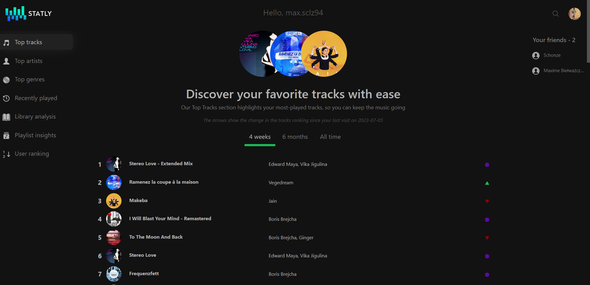
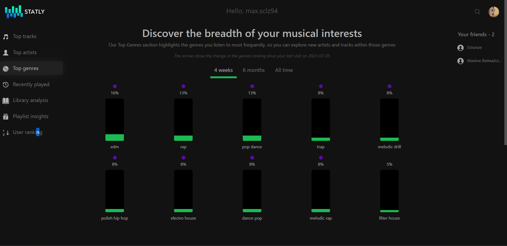
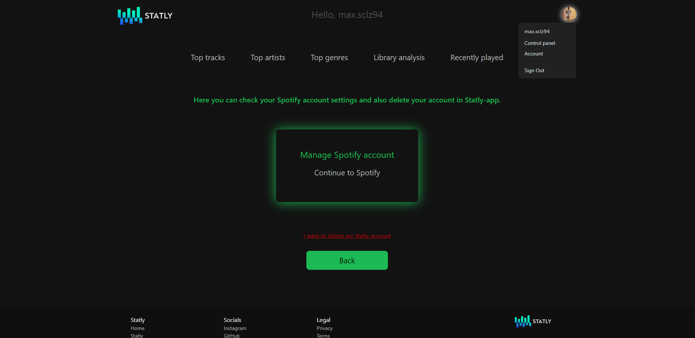

# Statly - Your personal Spotify stats🎵

Statly is a web application powered by Spotify API that lets you view your music
statistics, account mainstream score, and recently played tracks.
You can also export a playlist to your Spotify account from your favourite tracks in three different
ranges.

Check out [Statly](https://laa66.github.io/statly-frontend/) to see the application in action.

**Important Note!**

    To access the app, please click on "Join Beta" and register with your full name and 
    Spotify email address associated with your Spotify account.

    This is necessary because I use the basic version of the Spotify API and I
    need to add testers to Spotify developer panel to grant them access.

## How to run ⚡

#### It's simple! Go and check [Statly](https://laa66.github.io/statly-frontend/) or...
#### Try to run this application on your local machine. You will need to do the following:

1. Obtain a **Client ID** and **Client secret** from [Spotify Developer](https://developer.spotify.com/) panel
2. Set the ``SPOTIFY_CLIENT_ID``, ``SPOTIFY_CLIENT_SECRET`` environment variables
   with the values from your Spotify Developer panel and set ``STATLY_APP_URL``
   variable to ``http://localhost:3000``
3. Set the ``STATLY_DB_URL``, ``STATLY_DB_USERNAME`` and ``STATLY_DB_PASSWORD`` environment variables with the MySQL details.
4. Set the ``STATLY_ADMIN_EMAIL`` variable to administrator's email to receive notifications about the app, set ``STATLY_MAIL_ADDRESS`` and ``STATLY_MAIL_PASSWORD`` for Gmail SMTP server properties.
<!-- end -->

      # Clone this repository to your local machine
      $ git clone https://github.com/laa66/statly-backend-api.git

      # Run the backend Spring Boot application in the root project directory:
      $ ./mvnw spring-boot:run

      # Clone React-app repository to your local machine
      $ git clone https://github.com/laa66/statly-frontend.git
      
      # Run the frontend React app in the project root directory: 
      $ npm start

#### ...and Access the application in your web browser at ``http://localhost:3000``

## How to use 🗺️

1. At the very beginning, try to register as beta-tester on the Home page.
   Your access should be granted after 15 minutes.
2. Click on ``Login with Spotify`` button on the Home page. You will be redirected to Spotify account service
3. Login with your Spotify username and password
4. **Congratulations!** Now you can use all features of Statly

## Features 📌
#### Here, you can check app features:

* Allows users to see their ``top tracks`` based on their listening habits over three different time ranges

* Enables users to ``export playlists`` containing their favorite tracks based on their listening habits over three different time ranges

* Enables users to view their ``top artists`` over three different time ranges

* Shows users their ``top genres`` over three different time ranges

* Displays a user's ``mainstream score`` based on the popularity of the tracks they listen to

* Allows users to view their ``recently played`` tracks, giving them easy access to music they have enjoyed

* Redirect user to ``Spotify web player`` immediately after clicking on some resources e.g. on special track, artist or created playlist

With these features Statly provides an easy and efficient way for users to explore and interact with their Spotify listening data.
The app is powered by the Spotify API and makes use of the OAuth2 authorization flow with Spring Boot for backend and React for frontend.
Users can access the app through the web, it is deployed on Railway cloud, GitHub pages and PlanetScale providing easy access to anyone who wants to connect their Spotify account and check their listening habits.

## Documentation 📖

You can view full documentation of this project in different paths:

- Spring Boot REST API [documentation](./docs/REST-API-README.md)
- React App [documentation](./docs/React-app-README.md)

## Built with 🔨

#### Technologies & tools used:

- Java 19
- Spring Boot 3 (Spring REST, Spring Data JPA, Spring MVC, Spring Security, Spring AOP, Spring Mail)
- Hibernate & JPA
- Maven
- OAuth 2.0
- SQL
- React.js
- HTML & CSS
- Bootstrap v5.3
- IntelliJ IDEA Community Edition
- Visual Studio Code
- MySQL Workbench
- PlanetScale
- Railway Cloud
- GitHub Pages

#### Tested with:

- Spring Boot Test
- JUnit 5 & AssertJ
- Mockito
- Hamcrest
- Testcontainers

## To-do 💡

- Implement functionality for comparing user listening habits over the past 6 months/all time.
- Develop functionality to analyze tracks structure in the user's Spotify library
- Implement functionality that will allow users to add friends and check their statistics
- Develop 'Playlist-battle' functionality
- Develop 'Silent-disco room' functionality
- Integrate small web player into the React-app that can play user's top songs within the browser
- Move Spotify-powered app from development mode to extended modem, enabling anyone to use Statly without needing to register for the beta

## Screenshots 🛣️

