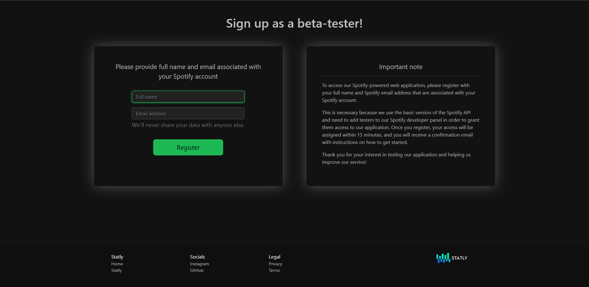
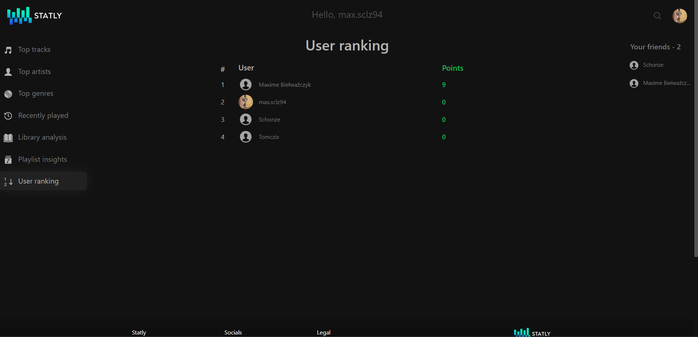
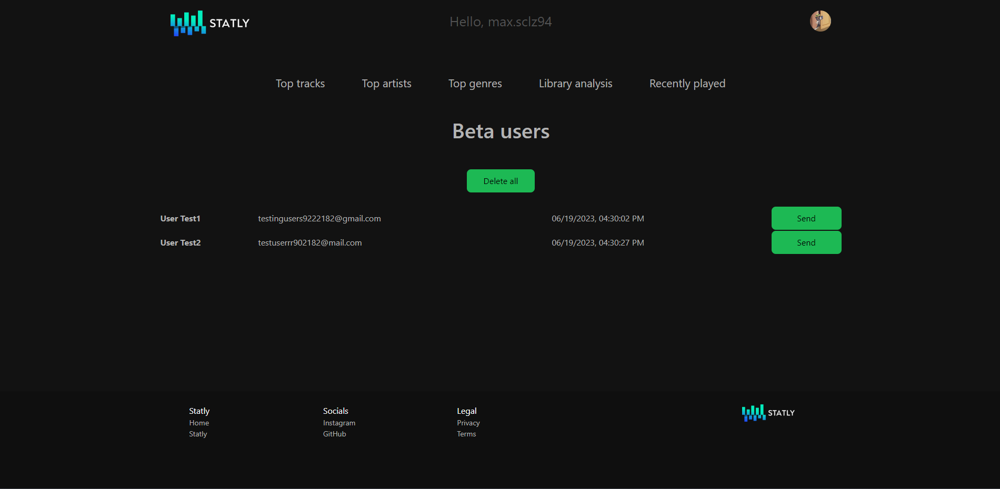

# Statly - Your personal Spotify stats🎵

Statly is a web application powered by Spotify API that lets you view your music
statistics, analyze your audio library, playlists, check recently played tracks, follow friends, match music libraries and create playlist battles.
You can also export a playlist to your Spotify account from your favourite tracks in three different
ranges.

Check out [Statly](https://laa66.github.io/statly-frontend/) to see the application in action.

**Important Note!**

    To access the app, please click on "Join Beta" and register with your full name and 
    Spotify email address associated with your Spotify account.

    This is necessary because I use the basic version of the Spotify API and I
    need to add testers to Spotify developer panel to grant them access.

## How to run ⚡

#### It's simple! Go and check [Statly](https://laa66.github.io/statly-frontend/) or...
#### Try to run this application on your local machine. You will need to do the following:

      # Clone this repository to your local machine
      $ git clone https://github.com/laa66/statly-backend-api.git

Create ``.env`` file in root project directory and set specific key-value pairs within it:
1. Obtain a **Client ID** and **Client secret** from [Spotify Developer](https://developer.spotify.com/) panel
2. Set ``SPOTIFY_CLIENT_ID``, ``SPOTIFY_CLIENT_SECRET`` environment variables
   with the values from your Spotify Developer panel
3. Set ``STATLY_APP_URL`` variable to `http://localhost:3000`
4. Set ``STATLY_ADMIN_EMAIL`` variable to administrator's email to receive notifications about the app
5. Set ``STATLY_MAIL_ADDRESS`` and ``STATLY_MAIL_PASSWORD`` for Gmail SMTP server properties
6. Set ``STATLY_SECRET`` to Base64 encoded secret phrase for JWT signature Secret Key generation (HMAC-SHA256)
7. Set ``MATRIX_API_TOKEN`` to your Mapbox account secret token
8. Set ``MAP_API_PUBLIC_TOKEN`` to your Mapbox account public token
<!-- end -->

      # Run statly-backend-api using docker-compose in root directory
      $ docker-compose up

      # Clone the React-app repository to your local machine
      $ git clone https://github.com/laa66/statly-frontend.git
      
      # Run statly-frontend using docker-compose in root directory
      $ docker-compose up

#### ...and Access the application in your web browser at ``http://localhost:3000``

## How to use 🗺️

1. At the very beginning click ``Join Beta`` button on the home page and try to register as beta-tester with your Spotify firstname, lastname and email address. Your access should be granted after 15 minutes. You will receive confirmation email :)
2. Click on ``Login with Spotify`` button on the Home page. You will be redirected to Spotify account service
3. Login with your Spotify username and password
4. **Congratulations!** Now you can use all features of Statly

## Features 📌
#### Here, you can check app features:

* Allows users to see their ``top tracks`` based on their listening habits over three different time ranges

* Enables users to ``export playlists`` containing their favorite tracks based on their listening habits over three different time ranges

* Enables users to view their ``top artists`` over three different time ranges

* Shows users their ``top genres`` over three different time ranges

* Calculate and displays a user's ``library audio analysis`` based on different indicators such as average energy, tempo, mainstream, boringness etc.

* Displays user's ``all playlists`` and give them ability to calculate playlist energy, tempo, mainstream and boringness score

* Allows users to view their ``recently played`` tracks, giving them easy access to music they have enjoyed

* Searching, following/unfollowing ``friends`` and checking their favourite songs, artists and library audio analysis

* Calculating percentage ``music library match`` (based on genres, artists and songs) with other users

* Creating a ``playlist battle`` between users, earning points, and viewing the ranking

* Finding users with ``the best music library match`` and displaying them on Earth map

* Finding ``nearby users`` and displaying them on Earth map

* Redirecting users to ``Spotify web player`` immediately after clicking on some resources e.g. on special track, artist or created playlist

* Sending ``email notifications`` to users

* ``Synchronizing user data`` with their Spotify library on initial login

* Assigning ``beta access`` to users by Admin

With these features Statly provides an easy and efficient way for users to explore and interact with their Spotify listening data.
The app is powered by Spotify API and Mapbox API and also makes use of the OAuth2 authorization flow with Spring Boot for backend and React for frontend.
Users can access the app through the web, it is deployed on Railway cloud and GitHub pages providing easy access to anyone who wants to connect their Spotify account and check their listening habits.

## Documentation 📖

You can view full documentation of this project in different paths:

- Spring Boot REST API [documentation](./docs/REST-API-README.md)
- React App [documentation](./docs/React-app-README.md)

## Built with 🔨

#### Technologies & tools used:

- Java 19
- Spring Boot 3 (Spring MVC, Spring Security, Spring Data JPA, Spring AOP, Spring Mail)
- Hibernate
- Maven
- Project Lombok
- JWT
- OAuth 2.0
- Docker
- MySQL
- React.js
- HTML & CSS
- Bootstrap
- Spotify API
- Mapbox API
- Railway Cloud
- GitHub Pages
- IntelliJ IDEA Community Edition
- Visual Studio Code
- MySQL Workbench

#### Tested with:

- Spring Boot Test
- JUnit 5 & AssertJ
- Mockito
- Hamcrest
- Testcontainers

## To-do 💡

- Common song and artist among two users
- User QR code
- Implement functionality for comparing user listening habits over the past 6 months/all time
- Integrate small web player into the React-app that can play user's top songs within the browser
- Move Spotify-powered app from development mode to extended modem, enabling anyone to use Statly without needing to register for the beta

## Screenshots 🛣️

